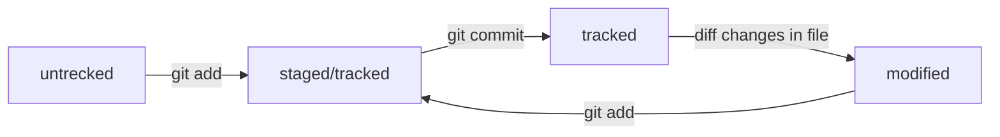
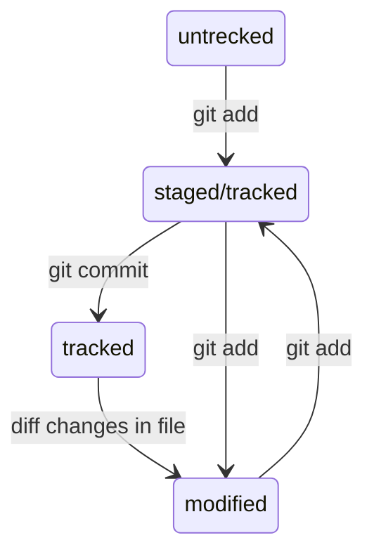

# Как работать с GIT

Шпаргалка по GIT

### Локальный репозиторий

1. Создаем репозиторий. 
Зайти в терминал и создать папку проекта `mkdir my_project`.

2. Инициализируем Git-репозиторий. 
Зайти в папку проекта и сделать ее git-репозиторием `cd my_project && git init`.

3. Отслеживаем статус проекта. 
Статус проета *my_project* можно отследить командой `git status`.

4. Подготовка к сохраниеню. 
Запоминаем состояние фаила `git add todo.txt` или `git add --all`, если хотим внести все фаилы в репозитории *my_project*.

5. Коммит. 
`git commit -m 'Какие изменения произошли'`. 
Хеш — основной идентификатор коммита. Git хеширует информацию о коммите с помощью алгоритма SHA-1 и получает для каждого коммита свой уникальный хеш — результат хеширования. Вместо хеша последнего коммита можно написать слово `HEAD`.

6. История коммитов
Вывести историю коммитов (по умолчанию в обратном порядке) `git log`. Сокращенный хеш `git log --oneline`.

### SSH
1. В домашней деректории `cd ~` генерируем SSH-ключ.  Согласно инструкции [GitHub](https://docs.github.com/en/authentication/connecting-to-github-with-ssh/generating-a-new-ssh-key-and-adding-it-to-the-ssh-agent) можно сделать командами `ssh-keygen -t ed25519 -C "your_email@example.com"` или `ssh-keygen -t rsa -b 4096 -C "your_email@example.com"`

2. Скопировать публичный ключ `pbcopy < ~/.ssh/id_ed25519.pub` для ed25519 или `pbcopy < ~/.ssh/id_rsa.pub` для rsa 4096

3. Добавляем в настройках GitHub новый SSH ключ. Копируем публичный ключ в поле.
Проверить ключ можно командой `ssh -T git@github.com`

### Связываем локальный и удаленный репозитории
1. Перейди на страницу удалённого репозитория, выбери тип SSH и скопируйте URL

2. В локальном репозитории проекта *my_project* выполнить команду `git remote add origin git@github.com:%ИМЯ_АККАУНТА%/my_project.git`

3. Направить изменения в удаленный репозиторий `git push -u origin main` или `git push -u origin master`. Для последующих изменений `git push`

### Статус фаила

- untracked
- tracked
- staged
- modified

Схема создается с помощью [Mermaid](http://mermaid.js.org). Для быстрого погружения как нарисовать свою первую диаграму можно прочитать на [Хабре](https://habr.com/ru/articles/652867/).

### Сообщение к коммитам
Придерживайся одного сообщения стиля в проекте.

#### Conventional Commits

Общий вид: `<type>: <сообщение>`  
где *type* может принимать значениея `feat` или `fix`

Подробнее можно узнать в [спецификации](https://www.conventionalcommits.org/ru/v1.0.0-beta.4/#спецификация)

#### Корпоративный

Общий вид: `<Jira-ID>: <сообщение>`  
где *Jira-ID* идентификатор задачи проекта

#### GitHub-стиль

Общий вид: `#<номер задачи> <сообщение>`.

### Как внести измененния в коммит

1. В последний коммит внести изменения можно так: 
`git add` 
`git commit --amend --no-edit` 
Eсли нужно отредактировать сообщение к коммиту то поможет `git commit --ameng -m "add new massage"`.

2. Если нужно убрать из staging area 
`git restore --staged <file>`.

3. Откат коммита: 
`git reset --hard <commit hash>`

4. Откатить изменения до последней сохраненной версии:  
`git restore <file>`

### Как посмотреть изменения

Посмотреть изменения в modified: 
`git diff`

В staged: 
`git diff --staged`

Посмотреть изменения между коммитами с хеш *hash1* и *hash2*: 
`git diff <hash1> <hash2>`

### Игнорируемые фаилы

Git игнорирует фаилы, которые следуют правилам в *.gitignore*. 
Посмотреть что игнорируется можно с помощью `git status --ignored`.

*.gitignore* следует закоммитить.

